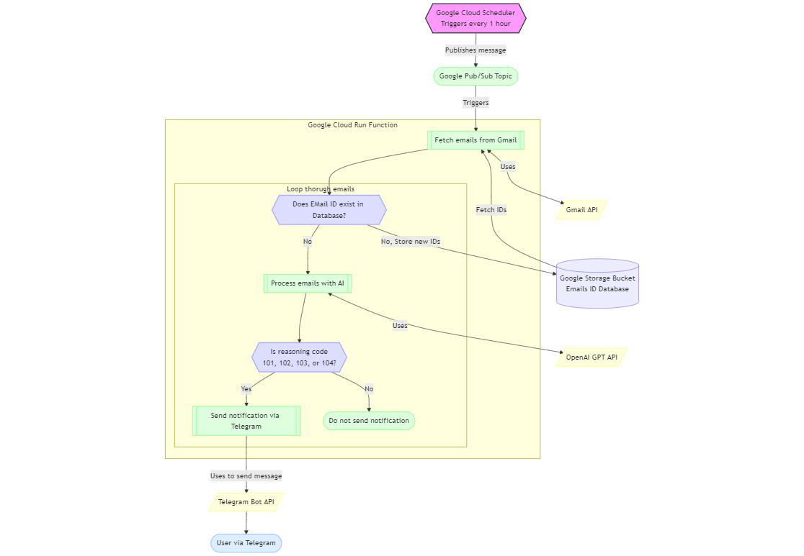

# Automated Email Processing and Notification System Using GPT and Google Cloud

## Overview
This project automates the process of fetching and analyzing emails using **Google Cloud** services and **GPT-4o-mini** from **OpenAI**. The system identifies important emails and sends notifications via **Telegram**. It’s designed to help manage email overload, focusing specifically on job-related communications.

## Architecture



- **Google Cloud Scheduler**: Triggers the process every hour.
- **Google Cloud Pub/Sub**: Acts as the communication mechanism between services.
- **Google Cloud Run**: Executes the cloud function that fetches and processes emails.
- **Gmail API**: Retrieves emails from your Gmail inbox.
- **OpenAI GPT-4o-mini**: Analyzes email content to classify its importance.
- **Telegram API**: Sends notifications about important emails directly to the user.
- **Google Cloud Storage**: Stores processed email IDs to avoid redundant processing.

## Features
- **Automated Email Fetching**: Retrieves emails from Gmail using the **Gmail API**.
- **AI-based Email Analysis**: Uses **GPT-4o-mini** to classify emails and determine their importance.
- **Telegram Notifications**: Important emails are forwarded to your **Telegram** account for immediate attention.
- **Efficient Email Processing**: Processes emails one at a time to optimize resource usage and prevent overload.

## Tools & Technologies
- **Google Cloud Scheduler**
- **Google Pub/Sub**
- **Google Cloud Run**
- **Gmail API**
- **OpenAI GPT-4o-mini**
- **Telegram API**
- **Google Cloud Storage**

## Getting Started

### Prerequisites
- **Google Cloud** account with enabled **Cloud Run**, **Pub/Sub**, **Cloud Scheduler**, and **Storage API**.
- **Telegram Bot**: Set up a bot through Telegram and obtain its API key.
- **OpenAI API Key**: Access to **GPT-4o-mini** via OpenAI.

### Installation

1. Clone the repository:
    ```bash
    git clone https://github.com/yourusername/automated-email-processing.git
    ``` 

2. Create a **Telegram Bot** and obtain the API token and your user ID.
    - Communicate with father bot on telegram to create your bot.
    - after creating your bot start a chat with it.
    - go to the following link after adjusting it to find your user ID. "https://api.telegram.org/bot<YourBotToken>/getUpdates"
    


### Deploying Google Cloud Functions

#### Step 1: Create a Google Cloud Pub/Sub Topic

1. Navigate to the **Pub/Sub** section in Google Cloud Console.
2. Create a new topic named `gmail_notification`.

#### Step 2: Configure Cloud Scheduler

1. In the **Cloud Scheduler**, create a new job.
2. Set it to run every hour using this cron schedule:
    ```bash
    */60 * * * *
    ```
3. Set the target to **Pub/Sub** and select the `gmail_notification` topic.

#### Step 3: Deploy the Cloud Function

1. Go to the Google Run Functions. Create a new function and make sure that it gets triggered by the pub/sub.
2. upload these files in the repository and also add credentials and token json files.
3. test the function then deploy it.

### Usage
After deployment, the Cloud Scheduler will trigger the email processing function every hour.
You can monitor and debug logs via the Google Cloud Console.
Future Improvements
Add more detailed filtering of email content based on additional job-related keywords.
Build a dashboard for visualizing the email analysis in real time.

#### License
This project is licensed under the MIT License - see the LICENSE file for details.